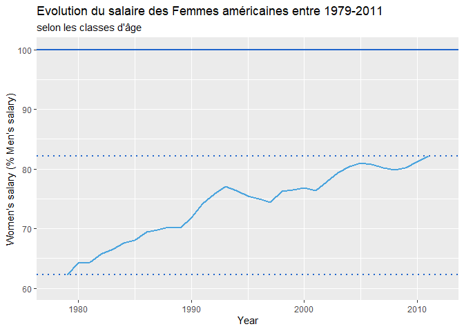
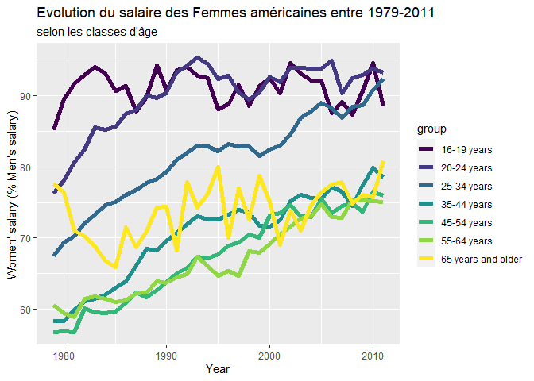
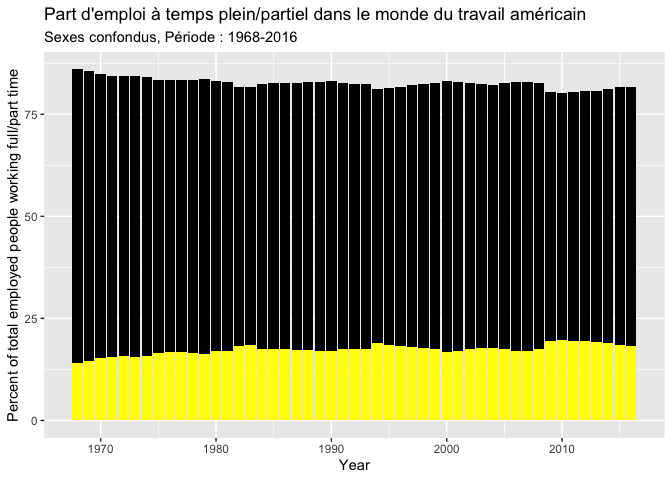
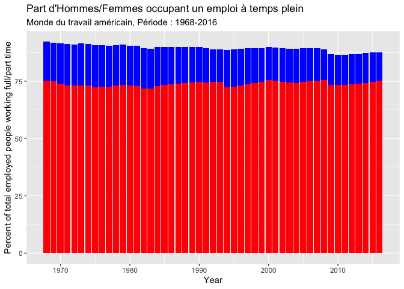
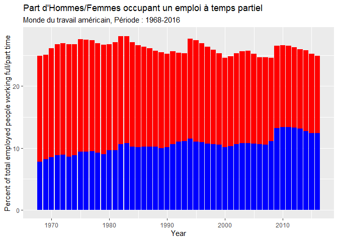
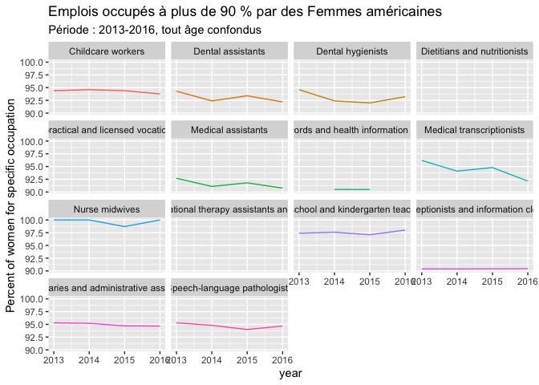

Etude de la place de la Femme dans le monde de travail américain -
DATABASE: Women in the workforce
================

## INTRODUCTION

Les inégalités entre les Hommes et les Femmes sont omniprésentes à la
surface du globe. En effet cette différence de traitement semble être
universelle, persistante à travers les âges et bien sûr en défaveur des
Femmes. En France, au Sénégal, au Brésil, en Chine, au Liban, sur tous
le globe , les femmes sont les premières touchées par des inégalités est
surtout au niveau du marché de travail à cause d’un système économique
qui est traditionnellement sexiste et qui n’est pas très juste.Nous
allons étudié l’ampleur des inégalités Homme-Femme liées au monde
professionnel et en particulier aux Etats-Unis d’Amérique. Nous allons
nous focaliser sur 3 aspects principaux c’est-à-dire le salaire,
l’emploi et les postes relatifs aux femmes américaines.

## SALAIRE DES FEMMES PAR RAPPORT A LEUR HOMOLOGUE MASCULIN

Sur le marché du travail, de nombreuses inégalités séparent les Hommes
des Femmes, de même qualifications tel que le salaire. Nous remarquons
qu’aux Etats-Unis d’Amérique sur la période 1979-2011 le salaire des
Femmes, tout âge confondu, n’a jamais égalé celui des Hommes pour une
même fonction. En effet nous remarquons dans le graphique suivant,
représentant le salaire des femmes (en % du salaire des Hommes), que ce
dernier n’a jamais atteint 100 % du salaire des Hommes. Bien que, de
fait, une inégalité salariale en défaveur des femmes structure la
société américaine on rémarque qu’il y a une évolution du salaire des
Femmes sur la période 1979-2011. Une réduction des inégalités salariales
entre Hommes-Femmes s’est bien effectuée. En 1979, le salaire des Femmes
représentait 62.3 % du salaire des Hommes alors qu’en 2011 le salaire
des Femmes représentait 82.2 % du salaire des Hommes soit une
augentation de 19.9 points.

<!-- -->

Sachant l’affirmation précédente concernant le salaire on peut se
demander :

  - Si cette tendance de réduction des inégalités salariales, pour tout
    âge confondu, se maintient pour chaque classes d’âge.
  - Si la variable classe d’âge influe sur les inégalités
salariales.

###### *LA TENDANCE DE REDUCTION DES INEGALITES SALARIALES SE MAINTIENT-ELLE POUR CHAQUE CLASSES D’ÂGE ?*

Le phénoméne de réduction des inégalités salariales est effectif, sur le
long terme, pour toutes les classes d’âge malgré que le salaire pour
chaque classes d’âge, à court terme, peut connaître d’importantes
variations, fluctuations. En effet, prenons l’exemple de la classe d’âge
25-34 ans, en 1979 le salaire des Femmes correspondait à 68 % du salaire
des Hommes alors qu’en 2011 le salaire des Femmes correspondait à 92.5 %
du salaire des Hommes; Soit une augmentation de 24.5
points.

###### *LA VARIABLE CLASSE D’ÂGE INFLUE T-ELLE SUR LES INEGALITES SALARIALES ?*

La variable classe influe les inégalités salariales dans le monde du
travail américain. De ce fait, deux dynamiques se dessinent en fonction
des classes âges. En effet nous avons 2 situations possibles:

  - De 16 à 34 ans : La réduction des inégalités salariales fut intense
    et a propulsé le salaire des Femmes autour des 90% du salaire des
    Hommes en 2011.
  - De 35 à 65 ans et plus : La réduction des inégalités salariales fut
    moins intense ou du moins les inégalités salariales étaient plus
    fortes pour ces classes en 1979. De ce fait en 2011 le salaire des
    Femmes environne les 77.5% du salaire des Hommes.

<!-- -->

## L’EMPLOI DES FEMMES PAR RAPPORT A LEUR HOMOLOGUE MASCULIN

La répartition entre emplois à temps partiel et à temps plein dans le
monde du travail américain, sexes confondus sur la période 1968-2016 n’a
que très peut évolué. Le graphique suivant représente la pourcentage
d’emplois à temps plein, représenté en noir et d’emplois à temps
partiel, représenté en jaune. Nous pouvons remarquer que la proportions
d’emploi à temps partiel et à temps plein sexes confondues n’a que très
peut augmenté. Les emplois à temps partiel correspondent à un peut moins
d’un quart des emplois totaux. En revanche les emplois à temps plein
représentent plus de 75% des emplois totaux. Nous allons nous focaliser
sur les proportions d’emploi à temps pleins/partiel occupés par des
Hommes/Femmes.

<!-- -->

###### *LES EMPLOIS A TEMPS PLEIN SONT-ILS ACCORDES PREFERENTIELLEMENT AUX HOMMES QU’AUX FEMMES ?*

La répartition des emplois à temps plein dans le monde du travail
américain, entre Homme et Femmes sur la période 1968-2016 n’a que très
peut évolué. Le graphique suivant représente la part d’emplois à temps
plein accordés aux Hommes dans la popultation masculine, représentée en
bleu et la part d’emplois à temps plein accordés aux Femmes dans la
popultation feminine, représentée en rouge. Nous pouvons remarquer que
le pourcentage de la population d’Hommes ayant un emploi à temps plein
est supérieure au pourcentage de la population de Femmes ayant un emploi
à temps plein. En effet environ 90% des Hommes ont un emploi à temps
plein contre 75% pour les
Femmes.

<!-- -->

###### *LES EMPLOIS A TEMPS PARTIELS SONT-ILS ACCORDES PREFERENTIELLEMENT AUX HOMMES QU’AUX FEMMES ?*

La répartition des emplois à temps partiel dans le monde du travail
américain, entre Homme et Femmes sur la période 1968-2016 n’a que très
peut évolué. Le graphique suivant représente la part d’emplois à temps
partiel accordés aux Hommes dans la popultation masculine, représentée
en bleu et la part d’emplois à temps partiel accordés aux Femmes dans la
popultation feminine, représentée en rouge. Nous pouvons remarquer que
le pourcentage de la population d’Hommes ayant un emploi à temps partiel
est inférieure au pourcentage de la population de Femmes ayant un emploi
à temps partiel. En effet environ 10% des Hommes ont un emploi à temps
plein contre 25% pour les Femmes.

<!-- -->

## LES POSTES ACCORDES AUX FEMMES

On s’intéresse maintenant à la représentation des Femmes dans chaque
postes balayant un bon nombre de domaines professionnnels. Le but étant
de déterminer pour quels postes ou domaines professionnels il existe un
détérminisme professionnels selon le
sexe.

###### *QUELS SONT LES POSTES OU DOMAINES PROFESSIONELS POUR LESQUELS LES FEMMES SONT SUR-REPRESENTEES ?*

Nous allons nous focaliser sur les domaines professionnels et plus
particulièrement les postes pour lesquels il y a un détérminisme en
faveur des Femmes. Pour exprimer ce déterminisme professionnel, cette
sur-représentation de Femmes on définit le déterminisme professionnel
positif comme l’ensemble des domaines professionnels dont plus de 90% de
leur effectif serait des Femmes. Ainsi nous que dans le monde du travail
américain, sur la période 2013-2016 tout âge confondus, les emplois pour
lesquels les Femmes représentent plus de 90% de l’effectif de
travailleurs sont :

  - Assistant dentaire
  - Hygiénistes dentaires
  - Assistant médical
  - Infirmière-sage-femme
  - Assistante maternelle
  - Maîtresse des écoles
  - Receptionistes et commis à l’information
  - Assistant administratif et secrétaire, …

Ainsi les principaux domaines professionnels concernés par ce
déterminisme positif sont les suivants :

  - Le service
  - Professionnels de la santé/technicien
  - Éducation, droit, service communautaire, arts et médias
  - Secrétariat et
Ventes

<!-- -->

###### *QUELS SONT LES POSTES OU DOMAINES PROFESSIONELS POUR LESQUELS LES FEMMES SONT SOUS-REPRESENTEES ?*

Maintenant nous allons nous concentrer sur les domaines professionnels
et plus particulièrement les postes pour lesquels il y a un détérminisme
en défaveur des Femmes. Pour exprimer ce déterminisme professionnel,
cette sous-représentation de Femmes on définit le déterminisme
professionnel négatif comme l’ensemble des domaines professionnels dont
moins de 10% de leur effectif serait des Femmes. Ainsi nous que dans le
monde du travail américain, sur la période 2013-2016 tout âge confondus,
les principaux domaines professionnels concernés par ce déterminisme
négatif sont les suivants :

  - Ressources naturelles, construction et entretien : Travailleurs des
    explosifs, Peintres, construction et entretien
  - Production, transport et déplacement de matériel : Machinistes,
    Conducteurs de chemin de fer et chefs de triage, fabricants de
    structure métallique
  - Informatique, ingénierie et sciences: Ingénieurs nucléaires,
    Ingénieurs mécaniques, Architectes de réseaux informatiques
  - Gestion, affaires et finances : Manager en construction, …

## CONCLUSION

De nos jours les inégalités Hommes-Femmes et notamment celles sur le
marché du travail persistent tant au niveau du salaire que du types
d’emplois (temps plein/partiel) ou de postes. Aujourd’hui les Femmes
font face à des inégalités salariales de l’ordre de 20% en moins que les
Hommes tout âge confondus. De plus on constate que la variable “âge” est
un facteur agravant les inégalités salariales des Femmes, à partir de 35
ans. Bien que, de fait les inégalités salariales existent, on peut
constater qu’il y a eut une réduction de ces dernières sur le long terme
sur la période 1979-2011. En ce qui concerne les proportions d’Hommes et
de Femmes occupant un emploi à temps plein et à temps partiel, on
constate que les Femmes occupent davantage un emploi à temps partiel que
les Hommes, qui eux occupent majoritairement un emploi à temps plein. Et
enfin en ce qui concerne les postes occupés par les Femmes on remarque
qu’il y a un certains détrminisme pour ne pas dire fatalité. Certains
postes sont majoritairement voire exclucivement féminin comme
assistant/hygiénistes dentaires, assistant médical,
infirmière-sage-femme, assistante maternelle, maîtresse des écoles,
réceptionistes et commis à l’information, assistant administratif et
secrétaire; C’est à dire des postes liés à la santé/esthétique, à
l’enfant ou bien au secrétariat. En revanche beaucoup de domaines
professionels sont majoritairement voire exclusivement masculin comme :

  - Ressources naturelles, construction et entretien
  - Production, transport et déplacement de matériel
  - Informatique, ingénierie et sciences
  - Gestion, affaires et finances Si la parité Homme-Femmes dans le
    monde du travail est l’objectif à atteindre par le gouvernement
    américain, il y a des amélioration mais certaines inégalités
    persistes à travers les âges
